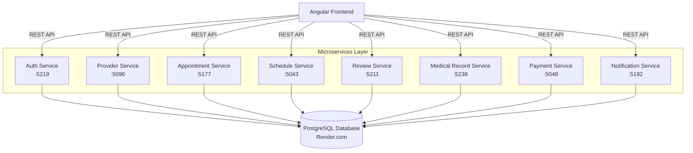
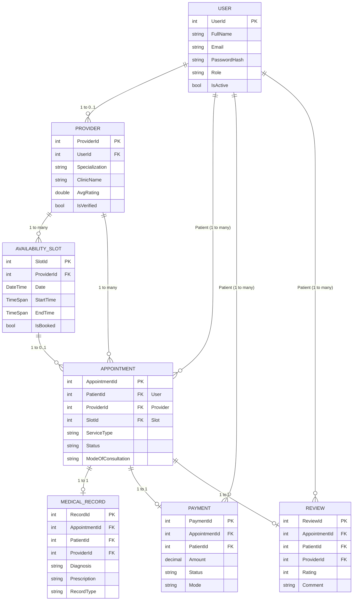
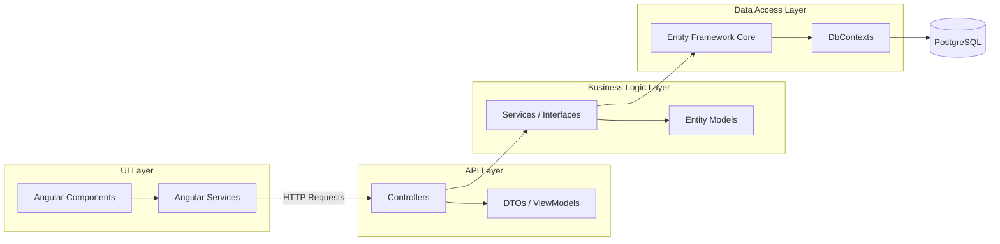
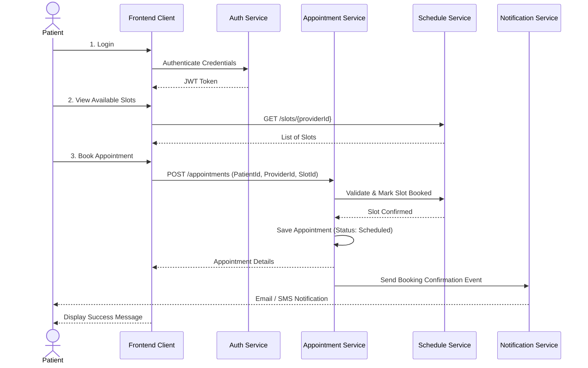
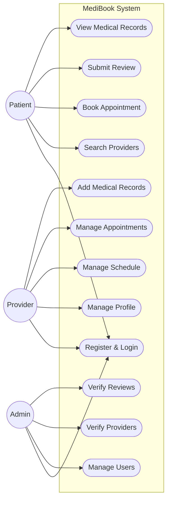

# MediBook Project Diagrams

This document contains Mermaid diagrams for the MediBook Online Appointment Booking System.

## 1. Architecture Diagram
This diagram illustrates the overall microservices architecture of the system.

## 2. Database ER Diagram
This entity-relationship diagram shows the core database tables and their relationships across the various microservices.

## 3. Design Diagram
This design diagram outlines the modular structure of the backend application, showing the logical layers (API, Business, Data).

## 4. Service Flow Diagram (Appointment Booking)
This sequence diagram shows the interaction between microservices when a patient books an appointment.

## 5. UML Use Case Diagram
This use case diagram represents the actors in the system (Patient, Provider, Admin) and their primary use cases.

